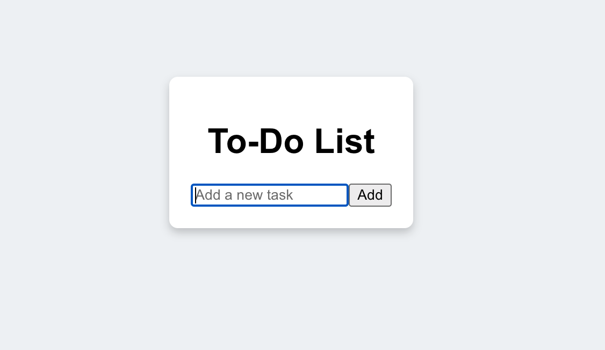
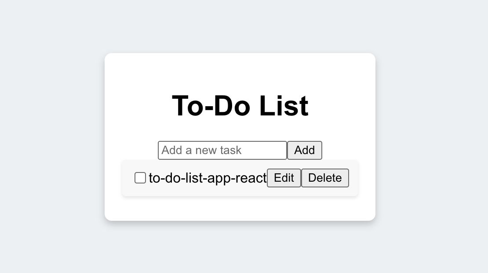
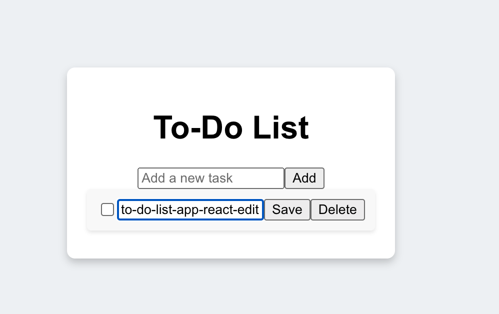
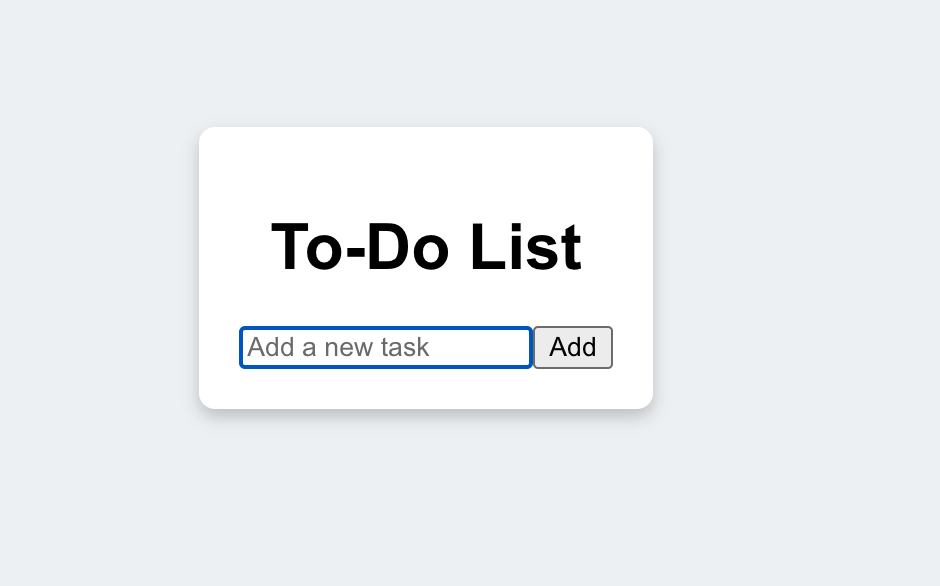
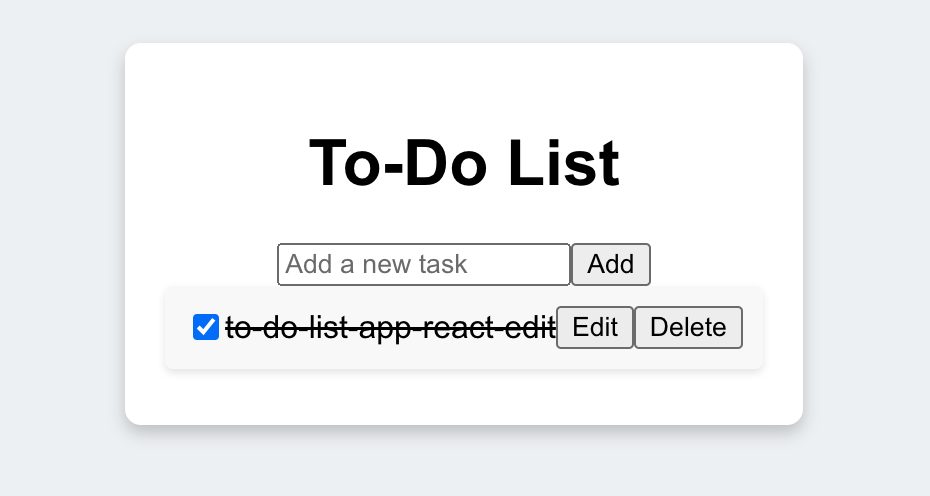

To-Do List Application This is a simple To-Do List application built with React. The application allows users to add, edit, delete, and mark tasks as completed.

Features Add Task: Users can add a new task to the list. Edit Task: Existing tasks can be edited by clicking the "Edit" button, allowing users to change the task description. Delete Task: Users can delete a task from the list by clicking the "Delete" button next to the task. Mark as Completed: Tasks can be marked as completed by checking the checkbox, and completed tasks will be shown with a strikethrough. Screenshots

Initial View
The initial view of the application. The title "To-Do List" is displayed with an input box and an "Add" button for adding new tasks.

Adding a Task
When a new task is added, it appears below the input field with a checkbox and "Edit" and "Delete" buttons.

Editing a Task
Clicking the "Edit" button allows users to modify the task. The "Edit" button changes to "Save," letting users save their changes.

Deleting a Task
The Delete button allows users to remove a task from the list. Once clicked, the task will be permanently removed from the list.

Marking a Task as Completed
When a task is marked as completed by checking the checkbox, it appears with a strikethrough, indicating that it’s done.

For the app implementation details please check the 'Implementation guide.docx' in repo list.
